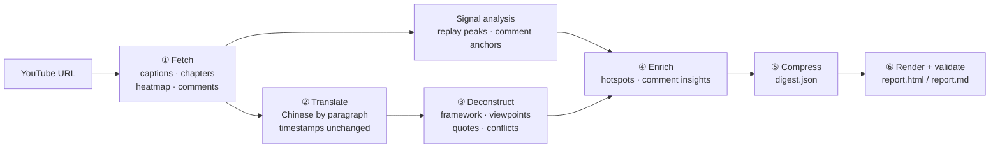

# youtube-interview-digest · YouTube interview digest

> Turn a one-hour YouTube interview or podcast into a **10-minute Chinese digest where every claim links back to the exact second in the video**.

[中文](README.md) · [Example report](examples/netflix-elizabeth-stone/) · [🌐 Live interactive version](https://chanyanming-a11y.github.io/youtube-interview-digest/example-report.html) · [Case study (中文)](docs/case-study.md)

[](https://github.com/chanyanming-a11y/youtube-interview-digest/actions/workflows/ci.yml)


**Contents**: [Quickstart](#quickstart) · [What you get](#what-you-get) · [Example](#example) · [Why not just a chat model](#why-not-just-paste-the-captions-into-a-model) · [How it works](#how-it-works)
· [Can't get the captions?](#cant-get-the-captions) · [Why trust the output](#why-trust-the-output) · [Known limitations](#known-limitations) · [FAQ](#faq) · [Compliance & privacy](#compliance--privacy) · [Directory structure](#directory-structure)

## Quickstart

```bash
git clone https://github.com/chanyanming-a11y/youtube-interview-digest.git
cd youtube-interview-digest
./install.sh                         # auto-detects your agent's skills dir
python3 -m pip install -r skills/youtube-interview-digest/requirements.txt   # Python ≥ 3.10
```

Then just ask your agent:

- "Summarize this YouTube interview with timestamps: <url>"
- "Break down this podcast — I want timestamps"
- "Here's a transcript file for an interview (.srt / .vtt / timestamped txt), digest it"

<details>
<summary>Other install methods (manual copy / Claude Code plugin marketplace / let your agent do it)</summary>

**Manual**: copy the `skills/youtube-interview-digest/` directory into your agent's skills directory, or run `./install.sh ~/.your-agent/skills` to point it somewhere specific.

**Claude Code plugin marketplace (one line)**

```bash
/plugin marketplace add chanyanming-a11y/youtube-interview-digest
/plugin install youtube-interview-digest@youtube-interview-digest
```

**Let your agent install it**: paste this into your coding agent.

> Please clone this skill repo (https://github.com/chanyanming-a11y/youtube-interview-digest) locally and copy its `skills/youtube-interview-digest/` directory into your agent's skills directory (e.g. Claude Code's `~/.claude/skills/`). If unsure of the path, ask me which agent and skills dir I use. When done, briefly explain how to trigger it in chat.

</details>

The report is plain static HTML — no Node, no front-end build.

## What you get

A self-contained `report.html` plus a `report.md` whose timestamps are standard YouTube links you can paste into any note:

| Section | Contents |
|---|---|
| Verdict | value score (1–5), who it's for, pros and cons, key takeaways, things you can use right away, caveats |
| Structure | the interview split into segments in video order, each with a summary and timestamped points |
| Viewpoints | falsifiable claims plus the kind of evidence behind them (data / case / experience / analogy) |
| Quotes | English–Chinese pairs with "why it's worth remembering"; the English is verified verbatim |
| Viewpoint conflicts | five conflict types checked one by one, each with a clear position |
| Hotspots | replay peaks + comment focal points, with causes, plus cold zones viewers skip |
| Comments | top comments grouped by theme, marked as agreement / challenge / addition / joke |
| Books, tools, corrections | books, tools, companies, people; names and factual corrections |
| Full transcript | paragraph-by-paragraph Chinese translation, searchable, optional English, auto-scrolls during playback |

The page itself also gives you **click-to-seek timestamps**, **distraction-free playback** (it covers YouTube's embed chrome), **full-article read-aloud** (three voices, auto-selected) and **offline single-file sharing**. Details: [docs/report-page.en.md](docs/report-page.en.md).

## Example

[Netflix CPTO Elizabeth Stone on Lenny's Podcast](https://www.youtube.com/watch?v=t0GiTyz4syY) — a 72-minute episode, ~13k words, 218 comment threads. The report has 113 clickable timestamps, 6 TL;DR items, 8 framework nodes, 10 verified quotes, 6 viewpoint conflicts, 6 hotspots and 2 fact-checks.

👉 [Full report](examples/netflix-elizabeth-stone/) · [🌐 Live interactive version](https://chanyanming-a11y.github.io/youtube-interview-digest/example-report.html) · [Case study (中文)](docs/case-study.md)

## Why not just paste the captions into a model?

A general assistant gives you *a summary*. This gives you a report you can **verify, click and reproduce**.

| | Paste the captions into a chat model | NotebookLM-style video Q&A | This skill |
|---|---|---|---|
| Every claim links back to the exact second | ❌ timestamps get invented | ⚠️ cites, but not sentence-aligned | ✅ timestamps come from real caption paragraphs; out-of-range ones hard-fail |
| Are the "verbatim" quotes real? | ❌ usually reworded | ⚠️ depends on the model | ✅ fuzzy-matched against the transcript (0.6) — otherwise the report **refuses to publish** |
| What the audience cared about | ❌ invisible | ❌ invisible | ✅ replay heat curve + timestamps typed in comments, incl. cold zones |
| Where the speakers disagree | ❌ consensus only | ❌ consensus only | ✅ at least one **viewpoint conflict** is mandatory, including guest-vs-comments |
| Output | a chat message | a note inside the platform | ✅ a self-contained `report.html` + `report.md` |
| Repeatable | ❌ wording changes every run | ⚠️ unpredictable | ✅ the method lives in `references/`, scripts enforce structure and validation |

## How it works



Scripts handle the deterministic work (fetching, parsing, signal scoring, rendering, validation); the agent handles judgement (translation, deconstruction, synthesis, assessment). The methodology lives in [`references/`](skills/youtube-interview-digest/references/) so every run converges on the same structure and standard.

## Can't get the captions?

YouTube commonly gates proxies and datacenter IPs behind "sign in to confirm you're not a bot". `fetch_youtube.py` **degrades automatically**, so most of the time you don't need to do anything:

| Level | Source | Gets | Login |
|---|---|---|---|
| 1 | yt-dlp | everything | no |
| 2 | public watch page `ytInitialData` + InnerTube `/next` | meta, chapters, heatmap, comments | no |
| 3 | external transcript linked in the description (Substack) | diarised transcript with word-level timing | no |
| 4 | **automatic browser export** of "Show transcript" (Playwright driving your local Chrome) | captions | no |
| 5 | `--cookies-from-browser chrome` / `--cookies cookies.txt` | captions | **yes, explicit consent required** |
| 6 | **user-supplied**: text copied from "Show transcript", or a `.srt` / `.vtt` / `.json3` file | captions | no |

Exit codes: `0` success · `2` URL / network error · `3` blocked and the page fallback failed too · `4` everything except captions was saved — supply captions via levels 4–6.

**Cloud egress IP (sandbox / datacenter)?** YouTube blocks the caption API wholesale and cookies don't help — that's an environment limit, **don't retry**. Fetch once on your own machine:

```bash
./skills/youtube-interview-digest/local_fetch.sh "https://www.youtube.com/watch?v=<ID>"
# default output ~/yt_<ID> — hand that folder back to the agent
```

Only the fetch step needs network. Full export steps, supported formats, a copy-paste prompt and common snags: [docs/captions.en.md](docs/captions.en.md).

## Why trust the output

`render_report.py --strict` refuses to publish a report when:

- a summary item has no timestamp, or its timestamp is beyond the video length;
- an English quote can't be found in the transcript (fuzzy match, threshold 0.6);
- repeated lines (such as a cold-open teaser) resolve to the nearest occurrence, and timestamps drifting more than 90 seconds are corrected automatically;
- required sections (verdict, TL;DR, framework, viewpoints, quotes, hotspots) are empty — those raise warnings.

The analytical constraints live in [`analysis-framework.md`](skills/youtube-interview-digest/references/analysis-framework.md): viewpoints must be falsifiable; at least one conflict, and if there's no obvious one, look for implicit tension; fact-check before quoting a comment; and the value score must state both what earns points and what loses them.

## Known limitations

- **Captions are the bottleneck.** When your network is blocked *and* the description has no external transcript, you supply the captions or consent to reading browser cookies.
- **Embedded playback**: some creators forbid embedding, and a flagged network can trip errors 150 / 101 (`file://` can fail with 153). Timestamps then open YouTube in a new tab at the exact second.
- **Comment coverage**: the top 300 threads plus the first 5 replies of the 15 busiest threads — not the full comment set.
- **Heatmap**: only videos with enough views carry the "Most replayed" curve; hotspots then fall back to content and comments.
- **Analysis quality tracks the agent's model.** The scripts guarantee structure and verifiability; translation and judgement quality depend on the model you run.

## FAQ

- **Do I need Python?** Yes — fetching, parsing, scoring, rendering and validation are Python scripts (≥ 3.10). The final report is plain static HTML; no Node.
- **There are no captions / I can't fetch them — now what?** See [docs/captions.en.md](docs/captions.en.md). Whatever you export, **keep the timestamps**.
- **Why is there no heatmap / hotspots section?** Only videos with enough views carry "Most replayed" data; without it hotspots fall back to content and comments, and the report says so.
- **Player error 150 / 101 / 153?** The first two usually mean the creator forbade embedding; 153 means you opened the file over `file://`. Open the auto-started localhost preview to play in-page.
- **No sound, or robotic Chinese?** Voices are auto-selected: Edge Xiaoxiao Neural (`pip install edge-tts`, free, most natural) → Doubao (your own key) → browser-native (fallback). See [docs/report-page.en.md](docs/report-page.en.md).
- **Can I get translation only, without the analysis?** This skill is built for *deep reading*: framework, viewpoints, quotes and conflicts are mandatory output. For plain translation, just ask a model.
- **Does it support Bilibili / Xiaoyuzhou / local video files?** YouTube only, for now.
- **Does it send my data anywhere?** No server, no telemetry — see [PRIVACY.md](PRIVACY.md).

## Compliance & privacy

- For personal study and research. Respect YouTube's Terms of Service and content copyright.
- **When sharing a report publicly**, render with `render_report.py --no-transcript` so the full translated transcript is dropped and only the digest, short quotes and timestamps remain. YouTube captions are platform content — redistributing large chunks may breach ToS.
- This repo's `examples/` and the GitHub Pages demo are **rendered with `--no-transcript`**: no full transcript, no raw `transcript*.json` / `comments.json` committed, and no commenter usernames in the reports.
- Reading browser login cookies is sensitive; the skill requires explicit consent first. **Never commit a cookie file** — `.gitignore` excludes it.
- Data flow (what goes to YouTube, what stays local, how cookies are handled): [PRIVACY.md](PRIVACY.md). Security: [SECURITY.md](SECURITY.md).

## Directory structure

<details>
<summary>Expand the full tree</summary>

```
youtube-interview-digest/
├── skills/youtube-interview-digest/     ← copy this directory to install
│   ├── SKILL.md                         the pipeline the agent reads
│   ├── local_fetch.sh                   one-shot fetch on your own machine
│   ├── scripts/                         fetch / page_fallback / transcript_utils
│   │                                    / browser export / signal analysis / render / serve
│   ├── references/                      translation guide · deconstruction framework · digest schema
│   └── assets/report_template.html      report template
├── examples/netflix-elizabeth-stone/    full example (report + intermediate artefacts)
├── docs/                                landing page, case study, report-page & captions guides
├── tests/                               stdlib-only unit + security tests
├── .github/workflows/                   ci.yml (lint + tests + coverage gate) / release.yml
├── CONTRIBUTING.md · CODE_OF_CONDUCT.md · ROADMAP.md
├── SECURITY.md · PRIVACY.md · CHANGELOG.md
├── install.sh · pyproject.toml · LICENSE
└── social-preview.png
```

</details>

## Contributing

- **Want to change something?** Start with [CONTRIBUTING.md](CONTRIBUTING.md) (local setup, tests, lint, conventions), then pick from the [roadmap](ROADMAP.md) or an issue labelled `good first issue`.
- **Code of conduct**: [CODE_OF_CONDUCT.md](CODE_OF_CONDUCT.md).
- **Reporting a bug**: include the video link, repro steps and the section of `report.html` that misbehaves. Security issues go through the private channel in [SECURITY.md](SECURITY.md).

## Changelog

See [CHANGELOG.md](CHANGELOG.md) or the [Releases](https://github.com/chanyanming-a11y/youtube-interview-digest/releases) page.

## License

[MIT](LICENSE)
