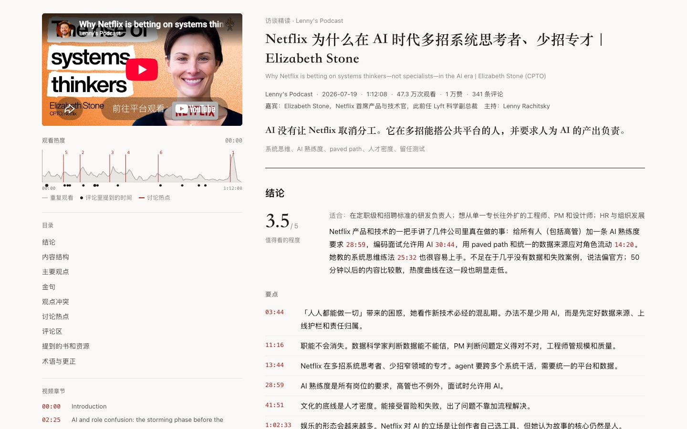

# youtube-interview-digest

> Turn a one-hour YouTube interview or podcast into a **10-minute Chinese digest where every claim links back to the exact second in the video**.

[中文](README.md) · [Example report](examples/netflix-elizabeth-stone/) · [Case study (中文)](docs/case-study.md)

[](https://github.com/chanyanming-a11y/youtube-interview-digest/actions/workflows/ci.yml)



## What it does

An agent skill in the `SKILL.md` format. Given a YouTube link (or a transcript file), the agent:

1. **Fetches** the timestamped transcript, creator chapters, the "Most replayed" heatmap, and top comments with replies
2. **Translates** the transcript paragraph by paragraph into Chinese, keeping every timestamp
3. **Deconstructs** the content into a framework, falsifiable viewpoints, verbatim quotes, and **viewpoint conflicts** (guest vs host, vs consensus, vs comments, self-contradictions, implicit tensions)
4. **Enriches** it with audience signals: replay peaks, timestamps that viewers typed in comments, and comment themes. It also flags cold zones that viewers skip
5. **Compresses** everything into `digest.json`: a one-line verdict, a TL;DR, and a value score with pros, cons, the target audience, and caveats
6. **Renders** `report.html` (sticky embedded player and heat curve; click any timestamp to seek) and `report.md`

## Why trust the output

`render_report.py --strict` refuses to publish a report when:

- a summary item has no timestamp, or its timestamp is beyond the video length
- an English quote can't be found in the transcript (fuzzy match). Repeated lines, such as a cold-open teaser, resolve to the nearest occurrence

## Why not just ask a model / NotebookLM?

A general assistant gives you *a summary*. This gives you a report you can **verify, click and reproduce**.

| | Paste the captions into a chat model | NotebookLM-style video Q&A | This skill |
|---|---|---|---|
| Every claim links back to the exact second | ❌ timestamps get invented | ⚠️ cites, but not sentence-aligned | ✅ timestamps come from real caption paragraphs; out-of-range ones hard-fail |
| Are the "verbatim" quotes real? | ❌ usually reworded | ⚠️ depends on the model | ✅ quotes are fuzzy-matched against the transcript (0.6) and the report **refuses to publish** otherwise |
| What the audience cared about | ❌ invisible | ❌ invisible | ✅ combines the "Most replayed" heat curve with timestamps typed in comments, incl. cold zones |
| Where the speakers disagree | ❌ consensus only | ❌ consensus only | ✅ at least one **viewpoint conflict** is mandatory, including guest-vs-comments |
| Output | a chat message | a note inside the platform | ✅ a self-contained `report.html` + `report.md` you can share offline |
| Repeatable | ❌ wording changes every run | ⚠️ unpredictable | ✅ the method lives in `references/`, the scripts enforce structure and validation |

## Example

[Netflix CPTO Elizabeth Stone on Lenny's Podcast](https://www.youtube.com/watch?v=t0GiTyz4syY). The episode is 72 minutes long, with about 13k words and 218 comment threads. The resulting report has 113 clickable timestamps, 6 TL;DR items, 8 framework nodes, 10 verified quotes, 6 viewpoint conflicts, 6 hotspots, and 2 fact-checks. See [`examples/`](examples/netflix-elizabeth-stone/).

> 🎬 **Demo**: below is a scroll-through of the report. The [live interactive version](https://chanyanming-a11y.github.io/youtube-interview-digest/example-report.html) lets you click any timestamp to seek — the best way to see it work.


## The report page

`report.html` is a self-contained static file — open it and it just works:

- **In-page playback with clickable timestamps**: a sticky player plus a custom minimal bar (progress / time / fullscreen); click any timestamp to seek. If a video forbids embedding, timestamps open YouTube in a new tab at the exact second.
- **Distraction-free playback**: YouTube's embed pops its own title bar and "more videos" shelf on pause / end (cross-origin iframe — CSS can't remove them). The report lays a **permanent transparent shield** over the player that swallows every pointer event, so YouTube never receives hover and never shows its chrome — even while playing. On pause / end the shield becomes a cover; a toggle restores the raw player.
- **Full-article read-aloud**: a "Read aloud" button reads every section block by block (verdict / framework / viewpoints / quotes / conflicts / hotspots / comments / transcript) with highlighting and auto-scroll. **Double-click any paragraph to start reading from there.** Three voices, auto-selected by availability:
  - **Microsoft Edge Xiaoxiao Neural** — free, no key, most natural (default; `pip install edge-tts` on the machine serving the report);
  - **Doubao** (Volcano Engine) — via `scripts/tts_config.example.json` → `tts_config.json` with `appid/token`;
  - **browser-native TTS** — offline fallback.
  Chinese timestamps are spoken as "X分Y秒" (e.g. `07:20` → "零七分二十秒").
- **Playback is automatic**: `render_report.py` spins up a local server (`serve_report.py`, bound to `127.0.0.1` only) and prints a `preview_url` with a valid origin, so the video plays inline and timestamps seek. The same server is the **local TTS proxy** — Doubao keys never enter `report.html` or the repo.
- **Offline single file**: `report.html` is self-contained (CSS / JS / data inlined; only thumbnails / video hit YouTube's CDN). Share it directly, no server needed. Opened via `file://`, it falls back to browser-native read-aloud.

## Install

```bash
git clone https://github.com/chanyanming-a11y/youtube-interview-digest.git
cd youtube-interview-digest
./install.sh                         # auto-detects your agent's skills dir
./install.sh ~/.your-agent/skills    # or point it at any agent that loads SKILL.md
python3 -m pip install -r skills/youtube-interview-digest/requirements.txt   # Python ≥ 3.10
```

Then ask the agent something like "summarize this YouTube interview with timestamps: <url>".

**Claude Code plugin marketplace (one line)**

```bash
/plugin marketplace add chanyanming-a11y/youtube-interview-digest
/plugin install youtube-interview-digest@youtube-interview-digest
```

**Install via your coding agent (no command line needed)**: paste the following to your agent and it will clone and place the skill in the right skills directory:

> Please clone this skill repo (https://github.com/chanyanming-a11y/youtube-interview-digest) locally and copy its `skills/youtube-interview-digest/` directory into your agent's skills directory (e.g. Claude Code's `~/.claude/skills/`). If unsure of the path, ask me which agent and skills dir I use. When done, briefly explain how to trigger it in chat, e.g. "summarize this YouTube interview with timestamps: <url>".

## Bot-check fallback chain

| Level | Source | Gets | Login |
|---|---|---|---|
| 1 | yt-dlp | everything | no |
| 2 | public watch page `ytInitialData` + InnerTube `/next` | meta, chapters, heatmap, comments | no |
| 3 | external transcript linked in the description (Substack podcasts) | diarised transcript with word-level timing | no |
| 4 | **automatic browser export** of "Show transcript" (`fetch_transcript_browser.py`, Playwright driving your local logged-in Chrome) | captions | no (reuses your local session) |
| 5 | `--cookies-from-browser` / `--cookies` | captions | **yes, only with explicit user consent** |
| 6 | **user-supplied**: full text copied from "Show transcript", or a `.srt` / `.vtt` / `.json3` file | captions | no |

Level 6 is the most common — and least error-prone — fallback. Full steps, supported formats, a copy-paste prompt and common snags are in [Can't get the captions?](#cant-get-the-captions-export-them-manually) below.

**Cloud egress IP (agent / sandbox)?** YouTube blocks the caption API wholesale (`RequestBlocked` / `page needs to be reloaded`), and login cookies don't help — it's an environment limit, not a skill bug. Don't retry; fetch once on **your own machine** (normal IP + logged-in Chrome) with `local_fetch.sh`, then hand the output folder back to the agent. Only the fetch step needs network.

```bash
# macOS Terminal (run from the cloned repo)
./skills/youtube-interview-digest/local_fetch.sh "https://www.youtube.com/watch?v=<ID>"
# or, if the skill is already installed, run local_fetch.sh inside that skills dir
```

### Can't get the captions? Export them manually

YouTube blocks the caption API wholesale for datacenter / proxy IPs, and some videos simply have no captions at all. **This is an environment limit, not a skill bug — don't retry.** The reliable path is to export the transcript once yourself; the agent handles translation, deconstruction and rendering.

#### Option A — YouTube's built-in "Show transcript" (recommended, nothing to install)

1. Open the video in a **desktop browser** (sign in first, so you don't hit the "confirm you're not a bot" gate).
2. Expand the description ("**...more**") and click **Show transcript** at the very bottom.
3. **Scroll the transcript panel to the bottom first** so the whole transcript loads — important for long videos.
4. **Keep timestamps on** (the ⋯ menu at the top-right of the panel toggles them). **Every clickable timestamp in the report depends on them** — with timestamps off, all jumps break.
5. Click inside the panel, select all (<kbd>Ctrl</kbd>/<kbd>⌘</kbd>+<kbd>A</kbd>), copy (<kbd>Ctrl</kbd>/<kbd>⌘</kbd>+<kbd>C</kbd>).
6. Paste it straight into the chat together with the video URL.

> The copy comes out as alternating "timestamp line / text line". The parser handles that as-is — **no manual cleanup needed**.
>
> Mobile: the YouTube app shows "Show transcript" inside the expanded description, but selecting a long transcript on a phone is painful — use a desktop for long videos.

#### Option B — download a caption file (precise timing, or you want to keep it)

yt-dlp is already a dependency, so one command gets the captions as a file:

```bash
# captions only, no video
yt-dlp --skip-download --write-subs --write-auto-subs \
       --sub-langs "en.*,zh-Hans" \
       -o "%(id)s.%(ext)s" "https://www.youtube.com/watch?v=<ID>"
# yields <ID>.en.vtt — .vtt is parsed directly, no ffmpeg conversion needed
```

For **your own** videos, YouTube Studio gives the authoritative file: Subtitles → pick the video → ⋯ next to the language → Download → `.srt`.

#### Option C — fetch everything on your own machine

When you also want the replay heatmap and comments, see `local_fetch.sh` above: one command on a normal IP with a logged-in Chrome gets captions + heatmap + comments.

#### Supported formats

| What you have | Works? | Note |
|---|---|---|
| text copied from "Show transcript" | ✅ | "timestamp line + text line"; duplicates are fine |
| `.srt` / `.vtt` / `.json3` | ✅ | auto-detected, **no** conversion needed |
| timestamped `.txt` (`[12:34] text` or `12:34 text`) | ✅ | |
| plain text with **no timestamps at all** | ❌ | every jump in the report needs a timestamp |

#### What to say to the agent (copy-paste)

> I can't get the captions automatically. Here is the full transcript I exported from YouTube's "Show transcript" (with timestamps).
> Video: https://www.youtube.com/watch?v=&lt;ID&gt;
> Please run the youtube-interview-digest pipeline on this transcript (translate → deconstruct → render).
> If the replay heatmap and comments aren't available this time, still render the report and note it under caveats.

Command-line equivalent (when `yt_<ID>/` already has meta / heatmap / comments):

```bash
python3 skills/youtube-interview-digest/scripts/transcript_utils.py \
  --file ./transcript.vtt --out ./yt_<ID> --video-id <ID>
```

It writes `transcript.md` / `paragraphs.json`, keeps any existing `meta.json` / heatmap / comments, and records `meta.subtitle_source` as `local:<filename>` so the report can state its provenance.

#### Common snags

| Symptom | Cause / fix |
|---|---|
| No "Show transcript" in the description | The creator disabled captions, the video is too new, there is no speech, or the language isn't supported. Use Option B, or retry in a few hours |
| The copied text has no timestamps | "Toggle timestamps" is off in the panel — turn it on and copy again |
| The agent says it can't parse any timestamps | Same as above, or you pasted plain text from a third-party tool |
| Caption language doesn't match the video | Switch the caption track at the bottom of the panel and pick the original (usually marked "auto-generated") |
| Captions work but there's no heatmap / comments | Normal — those are fetched separately. The report still renders; "hotspots" just falls back to content judgement |

## Known limitations

- **Captions are the bottleneck.** When your network is blocked *and* the video description has no external transcript, you have to supply the captions yourself (see "Can't get the captions?" above) or consent to reading browser cookies.
- **Embedded playback**: some creators forbid embedding, and a flagged network can make the player fail with error 150 / 101 (`file://` can fail with 153). In those cases timestamps open YouTube in a new tab at the exact second instead of seeking in place.
- **Comment coverage**: by default the top 300 threads plus the first 5 replies of the 15 busiest threads — not the full comment set.
- **Heatmap**: only videos with enough views carry the "Most replayed" curve. New or niche videos have none, so hotspots fall back to content and comments.
- **Analysis quality depends on the agent's model.** The scripts guarantee structure and verifiability; translation and judgement quality track the model you run.

## Directory structure

```
youtube-interview-digest/
├── skills/youtube-interview-digest/     ← copy this directory to install
│   ├── SKILL.md                         the pipeline the agent reads
│   ├── requirements.txt
│   ├── local_fetch.sh                   one-shot fetch on your own machine
│   ├── scripts/                         fetch / parse / analyse / render / serve
│   ├── references/                      translation guide, deconstruction framework, digest schema
│   └── assets/report_template.html      report template
├── examples/netflix-elizabeth-stone/    full example (report + intermediate artefacts)
├── docs/case-study.md                   what the example report is worth, section by section
├── docs/images/                         README screenshots + demo GIF
├── docs/index.html                      GitHub Pages landing page
├── tests/                               stdlib-only unit + security tests
├── .github/workflows/                   ci.yml (lint + tests + coverage gate) / release.yml
├── pyproject.toml                       ruff + coverage gate config
├── CONTRIBUTING.md · CODE_OF_CONDUCT.md · ROADMAP.md
├── SECURITY.md · PRIVACY.md · CHANGELOG.md
├── install.sh
└── LICENSE
```

## FAQ

**Do I need Python?**
Yes — fetching, parsing, scoring, rendering and validation are Python scripts (≥ 3.10). The final report is plain static HTML; no Node or front-end build.

**There are no captions / I can't fetch them — now what?**
Three options under "Can't get the captions?" above. Whatever you export, **keep the timestamps**.

**Why is there no heatmap / hotspots section?**
Only videos with enough views carry "Most replayed" data. Without it, hotspots fall back to content and comments and the report says so under caveats — that's a data limitation, not a rendering failure.

**Are the comments complete?**
No: the top 300 threads plus the first 5 replies of the 15 busiest threads. Full comment scraping is slow and trips rate limits.

**Player error 150 / 101 / 153?**
150 / 101 usually means the creator forbade embedding; 153 means you opened the file over `file://`. Timestamps then open YouTube in a new tab at the exact second — open the auto-started localhost preview to play in-page.

**Does it send my data anywhere?**
No server, no telemetry. See [PRIVACY.md](PRIVACY.md) for exactly what goes to YouTube and what stays local.

## Compliance

- For personal study and research. Respect YouTube's Terms of Service and content copyright.
- **When sharing a report publicly**, render with `render_report.py --no-transcript` so the full translated transcript is dropped and only the digest, short quotes and clickable timestamps remain. YouTube captions are platform content — redistributing large chunks may breach ToS.
- This repo's `examples/` and the GitHub Pages demo are **rendered with `--no-transcript`**: they keep only the digest, short quotes and translated comment excerpts — **no full transcript** — and the raw `transcript*.json` / `comments.json` are not committed. No commenter usernames appear in the reports.
- Reading browser login cookies is a sensitive operation; the skill requires explicit user consent first. **Never commit a cookie file** — `.gitignore` excludes it.
- Security (vulnerability reporting, SSRF / cookie notes): see [SECURITY.md](SECURITY.md).
- Privacy and data flow (what leaves your machine, what stays local, how cookies are handled): see [PRIVACY.md](PRIVACY.md).

## Changelog

See [CHANGELOG.md](CHANGELOG.md) or the [Releases](https://github.com/chanyanming-a11y/youtube-interview-digest/releases) page.

## Contributing

- **Want to change something?** Start with [CONTRIBUTING.md](CONTRIBUTING.md) (local setup, tests, lint, conventions), then pick from the [roadmap](ROADMAP.md) or an issue labelled `good first issue`.
- **Code of conduct**: [CODE_OF_CONDUCT.md](CODE_OF_CONDUCT.md).
- **Reporting a bug**: include the video link, repro steps and the section of `report.html` that misbehaves. Security issues go through the private channel in [SECURITY.md](SECURITY.md).

## License

[MIT](LICENSE).

