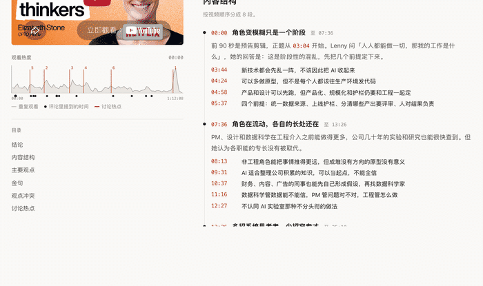
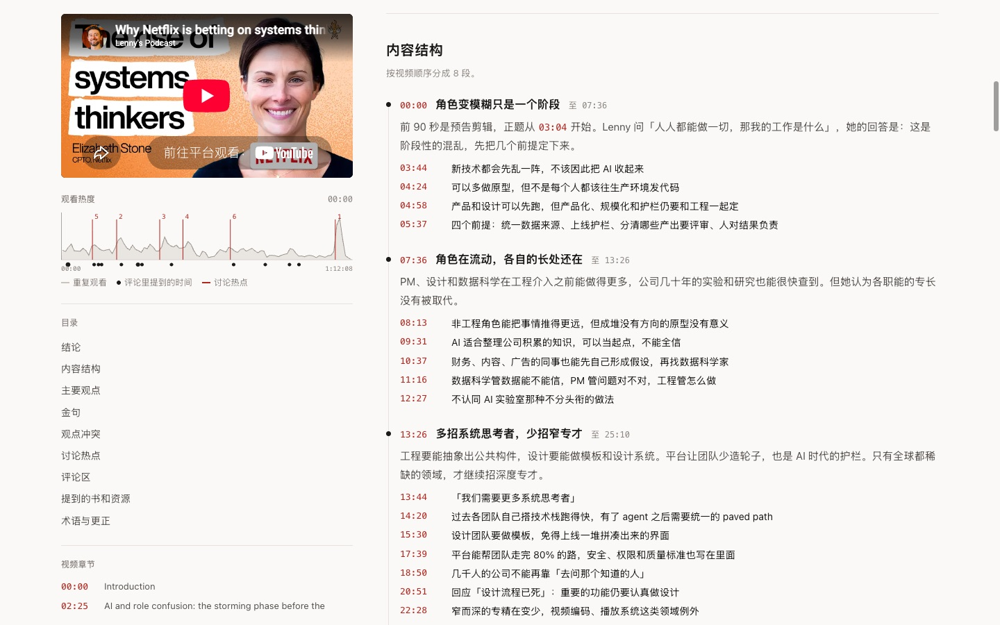
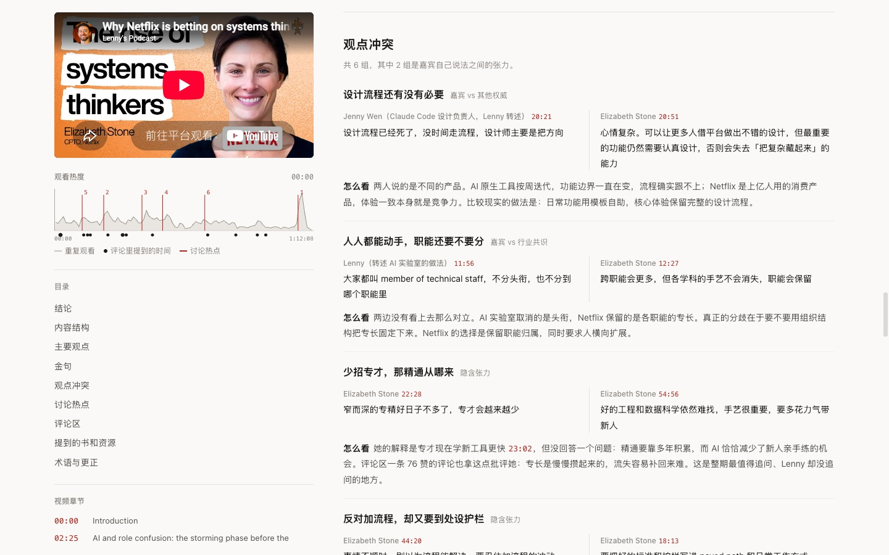
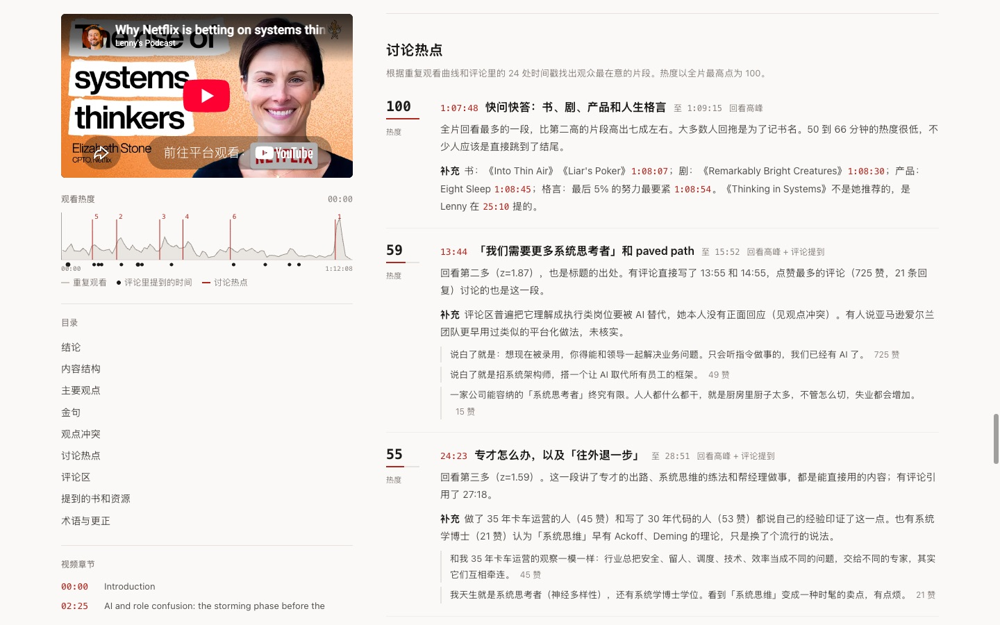
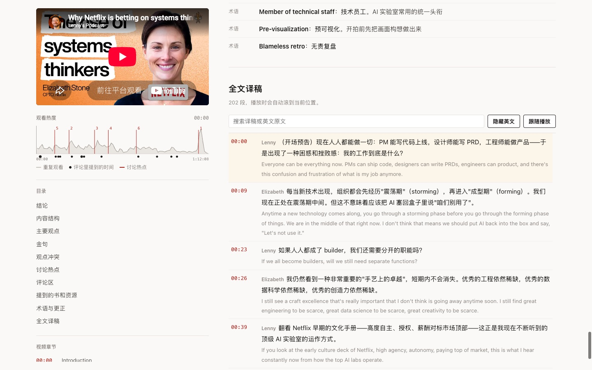
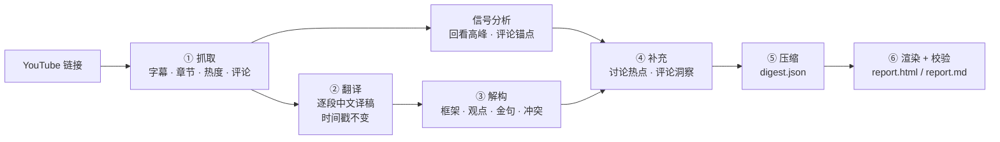

# youtube-interview-digest · 油管访谈精读

> 把一期 1 小时的 YouTube 访谈或播客，变成 **10 分钟读完、每句结论都能一键跳回原视频** 的中文精读报告。

[English](README.en.md) · [示例报告](examples/netflix-elizabeth-stone/) · [🌐 在线交互版](https://chanyanming-a11y.github.io/youtube-interview-digest/example-report.html) · [案例解读](docs/case-study.md)

[](https://github.com/chanyanming-a11y/youtube-interview-digest/actions/workflows/ci.yml)




**目录**：[快速开始](#快速开始) · [它产出什么](#它产出什么) · [效果示例](#效果示例) · [它解决什么问题](#它解决什么问题) · [它怎么工作](#它怎么工作)
· [抓不到字幕怎么办](#抓不到字幕怎么办) · [质量保障](#质量保障) · [已知限制](#已知限制) · [常见问题](#常见问题) · [合规与隐私](#合规与隐私) · [目录结构](#目录结构)

## 快速开始

```bash
git clone https://github.com/chanyanming-a11y/youtube-interview-digest.git
cd youtube-interview-digest
./install.sh                                     # 自动探测你的 agent skills 目录并安装
python3 -m pip install -r skills/youtube-interview-digest/requirements.txt   # Python ≥ 3.10
```

装好后在对话里直接说：

- 「帮我总结这个油管视频 https://www.youtube.com/watch?v=… 」
- 「精读 / 拆解这期播客，要带时间戳」
- 「这是某期访谈的字幕文件（.srt / .vtt / 带时间戳的 txt），帮我做精读」

<details>
<summary>其他安装方式（手动复制 / Claude Code 插件市场 / 让 agent 代装）</summary>

**手动**：把 `skills/youtube-interview-digest/` 整个目录复制到你的 agent 的 skills 目录下；也可以 `./install.sh ~/.my-agent/skills` 显式指定。

**Claude Code 插件市场（一行命令）**

```bash
/plugin marketplace add chanyanming-a11y/youtube-interview-digest
/plugin install youtube-interview-digest@youtube-interview-digest
```

**让 agent 帮你装**：把下面这段话直接发给你的编程 Agent。

> 请帮我把这个 skill 仓库（https://github.com/chanyanming-a11y/youtube-interview-digest）克隆到本地，并把里面的 `skills/youtube-interview-digest/` 目录复制到你的 agent 的 skills 目录下（例如 Claude Code 的 `~/.claude/skills/`）。若不确定路径，先告诉我你用的 agent 与 skills 目录位置。完成后简要说明怎么在对话里触发它。

</details>

报告是纯静态 HTML，不需要 Node 或任何前端构建。

## 它产出什么

一份 `report.html`（自包含单文件）+ 一份 `report.md`（时间点是标准 YouTube 链接，可直接贴进笔记）：

| 板块 | 内容 |
|---|---|
| 结论 | 值得看的程度（1–5）、适合谁、优点和不足、要点、可直接拿去用的做法、读之前的局限 |
| 内容结构 | 访谈按视频顺序分段，每段有概括和带时间码的要点 |
| 主要观点 | 可被反驳的主张 + 论据类型（数据 / 案例 / 经历 / 类比） |
| 金句 | 中英对照 + 「为什么值得记」，英文原句已逐字校验 |
| 观点冲突 | 五类冲突逐一排查，每组都有立场鲜明的分析 |
| 讨论热点 | 回看高峰 + 评论焦点，含成因判断，并标出观众跳过的冷区 |
| 评论区 | 高赞评论按主题归纳，标出认同、质疑、补充或玩笑 |
| 提到的书和资源 · 术语与更正 | 书籍、工具、公司、人物；译名与口误 / 字幕错误更正 |
| 全文译稿 | 逐段中文译稿，可搜索、可显示英文，播放时自动滚到当前位置 |

报告页本身还能：**点任意时间码即 seek**、**无干扰播放**（盖掉 YouTube 内嵌弹出的推荐栏）、**全文朗读**（三音源自动优选）、**离线单文件分享**。细节见 [docs/report-page.md](docs/report-page.md)。

## 效果示例

以 Lenny's Podcast 一期访谈为例：[Netflix 为何在 AI 时代押注「系统思考者」｜Elizabeth Stone（CPTO）](https://www.youtube.com/watch?v=t0GiTyz4syY)。

| 输入 | 输出 |
|---|---|
| 72 分钟视频，约 1.3 万英文词 | 1 句结论 · 6 条 TL;DR · 5 条可直接落地的收获 · 价值评分 3.5/5 |
| 20 个创作者章节 | 8 个框架节点，每个节点下 2–7 个带时间戳的要点 |
| 100 点回看热度曲线 | 6 个讨论热点（含热度值与成因判断），并标出 50–66 分钟的冷区 |
| 218 条评论线程、47 条回复 | 7 个评论主题 · 6 组观点冲突 · 2 处事实纠错 |
| — | **113 个可点击时间点**，10 条中英对照金句，全部通过原文校验 |

👉 [完整报告](examples/netflix-elizabeth-stone/) · [🌐 在线交互版](https://chanyanming-a11y.github.io/youtube-interview-digest/example-report.html)（可直接点时间点跳转） · [价值拆解](docs/case-study.md)

<table>
<tr>
<td><br><sub>内容结构：按视频顺序分段，每个要点都能点回原视频</sub></td>
<td><br><sub>观点冲突：双方原话并排，下面是判断</sub></td>
</tr>
<tr>
<td><br><sub>讨论热点：回看高峰和评论里的时间戳</sub></td>
<td><br><sub>全文译稿：可显示英文、可搜索、跟随播放</sub></td>
</tr>
</table>

## 它解决什么问题

| 痛点 | 常见做法 | 这个 skill 的做法 |
|---|---|---|
| 英文长访谈没时间看完 | 让 AI 概括几段话 | 结论先行：一句话 + 3–6 条要点 + 价值评分，**每条都带可点击时间戳** |
| 看不出哪句是原话、哪句是 AI 编的 | 只能凭感觉信 | 金句**逐字比对原文**，匹配不上就拒绝出报告 |
| 不知道观众真正在意哪段 | 翻评论区 | 结合 YouTube「重复观看」热度曲线和评论里的时间戳，定位**热点与冷区** |
| 总结里只剩共识，没有锋芒 | 缺乏上下文 | 专门拆出**观点冲突**：嘉宾 vs 主持人 / 行业共识 / 评论区 / 前后自相矛盾 |

把视频丢给通用助手也能出摘要，但会缺三样东西：**可核验、可跳转、可复现**。

| | 直接粘贴字幕问大模型 | NotebookLM 等视频问答 | 这个 skill |
|---|---|---|---|
| 结论能否一键跳回原视频 | ❌ 时间戳容易编错 | ⚠️ 有引用但不保证逐句对齐 | ✅ 时间点取自真实字幕段落，超出时长直接报错 |
| 引用的「原话」是否可信 | ❌ 常见改写 / 润色 | ⚠️ 取决于模型 | ✅ 逐字比对原文（阈值 0.6），匹配不上**拒绝出报告** |
| 观众的关注点 | ❌ 看不到 | ❌ 看不到 | ✅ 回看热度曲线 + 评论里的时间戳，标出热点与冷区 |
| 观点的分歧面 | ❌ 通常只给共识 | ❌ 通常只给共识 | ✅ 强制至少 1 条**观点冲突**，含嘉宾 vs 评论区的反驳 |
| 产出形态 | 聊天里的一段文字 | 平台内的笔记 | ✅ 可离线分享的单文件 `report.html` + `report.md` |
| 每次结果是否一致 | ❌ 措辞每次都变 | ⚠️ 不确定 | ✅ 方法论写在 `references/`，脚本保证结构与校验一致 |

## 它怎么工作



脚本负责确定性工作（抓取、解析、信号计算、渲染、校验），agent 负责需要判断的部分（翻译、解构、归纳、评估）。方法论写在 [`references/`](skills/youtube-interview-digest/references/) 里，保证每次产出的结构和标准一致。

## 抓不到字幕怎么办

YouTube 常对代理和机房 IP 要求「登录以确认你不是机器人」。`fetch_youtube.py` 会**自动逐级降级**，多数情况不用管：

| 层级 | 数据来源 | 能拿到 | 需要登录 |
|---|---|---|---|
| 1 | yt-dlp | 全部数据 | 否 |
| 2 | 公开网页 `ytInitialData` + InnerTube `/next` | 元数据、章节、热度、评论 | 否 |
| 3 | 视频描述里的外部转写（Substack 播客） | 带说话人分离和词级时间戳的转写 | 否 |
| 4 | **自动浏览器导出**「显示文字记录」（Playwright 驱动本机 Chrome） | 字幕 | 否 |
| 5 | `--cookies-from-browser chrome` / `--cookies cookies.txt` | 字幕 | **是，需明确同意** |
| 6 | **用户手动导出**：「显示文字记录」复制全文，或提供 `.srt` / `.vtt` / `.json3` | 字幕 | 否 |

退出码：`0` 成功 · `2` URL / 网络错误 · `3` 被拦截且网页降级也失败 · `4` 除字幕外都已保存，需要按 4–6 层补字幕。

**出口 IP 是云 IP（沙箱 / 机房）时**，YouTube 会整体封锁字幕接口，连 cookie 也解不开——这是环境限制，**不要反复重试**。在你本机跑一次即可：

```bash
./skills/youtube-interview-digest/local_fetch.sh "https://www.youtube.com/watch?v=<ID>"
# 默认输出 ~/yt_<ID>；把该目录发回 agent，它会接着做翻译 / 解构 / 渲染
```

只有「抓取」这一步需要联网。**手动导出字幕的完整步骤、支持格式、可直接照抄的话术、常见卡点**见 [docs/captions.md](docs/captions.md)。

## 质量保障

`render_report.py --strict` 在出报告前会检查：

- **每个总结项都带时间戳**，并且不超出视频时长；
- **金句的英文原句必须能在字幕里找到**（模糊匹配，阈值 0.6），找不到就报错、不出报告；
- 同一句话在字幕里出现多次时（比如片头预告和正文），取离标注位置最近的那一处，并自动纠正偏差超过 90 秒的时间戳；
- 必填板块（一句话结论、TL;DR、框架、观点、金句、热点）为空时给出警告。

分析方法上的约束写在 [`analysis-framework.md`](skills/youtube-interview-digest/references/analysis-framework.md) 里：观点必须可以被反驳；冲突至少一条，没有明显冲突就找隐含张力；引用评论前先做事实核查；价值评分必须同时写加分和扣分项。

## 已知限制

- **字幕是瓶颈**：网络被拦截、视频描述里又没有外部转写时，需要你提供字幕或授权使用浏览器登录信息。
- **内嵌播放**：部分视频禁止内嵌，或被风控时播放器报错 150 / 101；`file://` 打开可能报 153。这些情况下时间点会自动改为新标签页跳转（带精确秒数）。
- **评论不是全量**：默认抓前 300 条热门线程，以及回复最多的 15 条线程的前 5 条回复。
- **热度数据**：只有播放量足够的视频才有「重复观看」曲线，新视频或冷门视频没有，这时只能靠评论和内容判断。
- **分析质量取决于 agent 的能力**：脚本保证结构和可验证性，翻译与判断质量取决于所用的模型。

## 常见问题

- **一定要装 Python 吗？** 要。抓取、解析、信号计算、渲染、校验都是 Python 脚本（≥ 3.10）；最终报告是纯静态 HTML，不需要 Node。
- **视频没有字幕 / 抓不到字幕怎么办？** 见 [docs/captions.md](docs/captions.md)。**导出的文本一定要带时间戳。**
- **为什么报告里没有「讨论热点」或热度曲线？** 只有播放量足够的视频才有「重复观看」数据；没有时热点改为按内容和评论判断，并在报告里注明。
- **内嵌播放器报错 150 / 101 / 153？** 前两个通常是作者禁止内嵌，153 是用 `file://` 打开导致的；用渲染时自动拉起的本地预览链接打开即可页内播放。
- **朗读没有声音，或中文音色很机械？** 音源按可用度自动优选：Edge 晓晓 Neural（`pip install edge-tts`，免费最自然）→ 豆包（需自己填密钥）→ 浏览器原生（兜底）。细节见 [docs/report-page.md](docs/report-page.md)。
- **只想翻译，不想解读，可以吗？** 这个 skill 的定位是「精读」：框架、观点、金句、观点冲突是强制产出。只要逐段纯翻译，直接让模型翻译更省事。
- **支持 B 站 / 小宇宙 / 本地视频吗？** 目前只支持 YouTube。
- **会把我的数据传出去吗？** 不。没有服务器、没有遥测，详见 [PRIVACY.md](PRIVACY.md)。

## 合规与隐私

- 本工具用于个人学习和研究。请遵守 YouTube 服务条款，尊重视频和转写的版权。
- **公开分享报告时**，建议用 `render_report.py --no-transcript` 去掉全文译稿，只保留摘要、短引用和时间戳。YouTube 字幕属平台内容，大段再分发可能有 ToS / 版权风险。
- 本仓库 `examples/` 与 GitHub Pages 上的示例报告**用 `--no-transcript` 渲染**，不含全文译稿，原始 `transcript*.json` / `comments.json` 未提交，报告里也不含评论者用户名。
- 使用浏览器登录信息属敏感操作，skill 要求 agent 先征得同意；**不要把 cookies 文件提交到仓库**（`.gitignore` 已排除）。
- 数据流向（什么发往 YouTube、什么留本地、cookie 怎么处理）见 [PRIVACY.md](PRIVACY.md)；安全相关见 [SECURITY.md](SECURITY.md)。

## 目录结构

<details>
<summary>展开完整目录树</summary>

```
youtube-interview-digest/
├── skills/youtube-interview-digest/     ← 复制这个目录即可安装
│   ├── SKILL.md                         流程总纲（agent 读取）
│   ├── local_fetch.sh                   本机一键抓取（绕开云 IP 封锁）
│   ├── scripts/                         fetch / page_fallback / transcript_utils
│   │                                    / browser 导出 / 信号分析 / 渲染 / 本地服务
│   ├── references/                      译稿规范 · 解构方法论 · digest 字段说明
│   └── assets/report_template.html      报告模板
├── examples/netflix-elizabeth-stone/    完整示例（报告 + 中间产物）
├── docs/                                落地页、案例解读、报告页与字幕抓取详解
├── tests/                               仅标准库的单元 / 安全测试
├── .github/workflows/                   ci.yml（lint + 测试 + 覆盖率门禁）/ release.yml
├── CONTRIBUTING.md · CODE_OF_CONDUCT.md · ROADMAP.md
├── SECURITY.md · PRIVACY.md · CHANGELOG.md
├── install.sh · pyproject.toml · LICENSE
└── social-preview.png
```

</details>

## 参与贡献

- **想改点什么**：先看 [CONTRIBUTING.md](CONTRIBUTING.md)（本地开发、跑测试与 lint、改动约定），再从[路线图](ROADMAP.md)或带 `good first issue` 标签的 issue 里挑。
- **行为准则**：[CODE_OF_CONDUCT.md](CODE_OF_CONDUCT.md)。
- **报 Bug**：附上视频链接、复现步骤和出问题的报告板块。安全问题请走私密渠道（[SECURITY.md](SECURITY.md)）。

## 更新记录

见 [CHANGELOG.md](CHANGELOG.md) 或 [Releases](https://github.com/chanyanming-a11y/youtube-interview-digest/releases)。

## License

[MIT](LICENSE)
