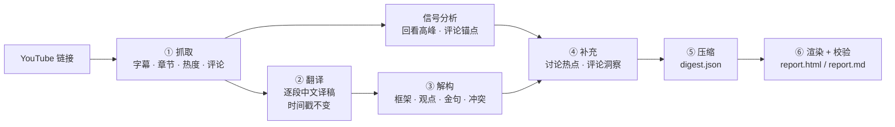

# youtube-interview-digest · 油管访谈精读

> 把一期 1 小时的 YouTube 访谈或播客，变成 **10 分钟读完、每句结论都能一键跳回原视频** 的中文精读报告。

[English](README.en.md) · [示例报告](examples/netflix-elizabeth-stone/) · [案例解读：这份报告的价值在哪](docs/case-study.md)

   


---

## 它解决什么问题

| 痛点 | 常见做法 | 这个 skill 的做法 |
|---|---|---|
| 英文长访谈没时间看完 | 让 AI 概括几段话 | 结论先行：一句话 + 3–6 条要点 + 价值评分，**每条都带可点击时间戳** |
| 概括看不出哪句是原话、哪句是 AI 编的 | 只能凭感觉信 | 金句**逐字比对原文**，匹配不上就拒绝出报告；所有时间点来自真实字幕段落 |
| 不知道观众真正在意哪段 | 翻评论区 | 结合 YouTube「重复观看」热度曲线和评论里的时间戳，定位**讨论热点和冷区** |
| 总结里只剩共识，没有锋芒 | 缺乏上下文的单句 | 专门拆出**观点冲突**：嘉宾 vs 主持人 / 行业共识 / 评论区 / 前后自相矛盾 / 隐含张力 |

## 效果示例

以 Lenny's Podcast 的一期访谈为例：[Netflix 为何在 AI 时代押注「系统思考者」｜Elizabeth Stone（CPTO）](https://www.youtube.com/watch?v=t0GiTyz4syY)。

| 输入 | 输出 |
|---|---|
| 72 分钟视频，约 1.3 万英文词 | 1 句结论 · 6 条 TL;DR · 5 条可直接落地的收获 · 价值评分 3.5/5 |
| 20 个创作者章节 | 8 个框架节点，每个节点下 2–7 个带时间戳的要点 |
| 100 点回看热度曲线 | 6 个讨论热点（含热度值、成因判断和补充信息），并标出 50–66 分钟的冷区 |
| 218 条评论线程、47 条回复 | 7 个评论主题 · 6 组观点冲突 · 2 处事实纠错 |
| — | **113 个可点击时间点**，10 条中英对照金句，全部通过原文校验 |

👉 看完整报告：[`examples/netflix-elizabeth-stone/`](examples/netflix-elizabeth-stone/)（或 [🌐 在线交互版](https://chanyanming-a11y.github.io/youtube-interview-digest/example-report.html)）　👉 看价值拆解：[`docs/case-study.md`](docs/case-study.md)

> 🎬 **演示**：在线交互版（链接同上）可直接点击时间点跳转，最能说明效果。
> <!-- 占位：录制一段 10–20 秒的屏录保存为 docs/images/demo.gif 后，取消下一行注释即可在此显示演示动画 -->
> <!--  -->

<table>
<tr>
<td><br><sub>内容结构：按视频顺序分段，每个要点都能点回原视频</sub></td>
<td><br><sub>观点冲突：双方原话并排，下面是判断</sub></td>
</tr>
<tr>
<td><br><sub>讨论热点：回看高峰和评论里的时间戳</sub></td>
<td><br><sub>全文译稿：可显示英文、可搜索、跟随播放</sub></td>
</tr>
</table>

## 报告包含什么

| 板块 | 内容 |
|---|---|
| 页首 | 中文标题、原标题、频道和播放数据、嘉宾、一句话结论、关键词 |
| 结论 | 值得看的程度（1–5）、适合谁、优点和不足、要点、可以直接拿去用的做法、读之前需要知道的局限 |
| 内容结构 | 访谈按视频顺序分成几段，每段有概括和带时间码的要点 |
| 主要观点 | 可被反驳的主张 + 论据类型（数据 / 案例 / 经历 / 类比） |
| 金句 | 中英对照，附「为什么值得记」，英文原句已和原文校验 |
| 观点冲突 | 五类冲突逐一排查，每组都有立场鲜明的分析 |
| 讨论热点 | 回看高峰 + 评论焦点，含成因判断和补充上下文 |
| 评论区 | 高赞评论按主题归纳，标出认同、质疑、补充或玩笑 |
| 提到的书和资源 | 书籍、工具、公司、人物 |
| 术语与更正 | 译名，以及对嘉宾口误和字幕错误的更正 |
| 全文译稿 | 逐段中文译稿，可搜索、可显示英文，播放时自动滚到当前位置 |

报告左侧固定内嵌播放器和热度曲线，点击任意时间码即可跳到对应位置；视频禁止内嵌时，会自动改为在新标签页打开 `youtube.com/watch?v=…&t=…s`。同时输出一份 Markdown 版，时间点是标准 YouTube 链接，可以直接贴进笔记或文档。

## 报告页的交互

报告是一个自包含的静态 HTML，双击即开、无需服务器：

- **页内播放 + 可点击时间戳**：左侧吸顶播放器配自建极简控制条（进度 / 时间 / 全屏）；点任意时间码即 seek 到对应秒。视频禁止内嵌时自动改为新标签页打开 `youtube.com/watch?v=…&t=…s`。
- **无干扰播放**：YouTube 自带内嵌会在暂停 / 结束时弹出标题栏、频道行和「更多视频」推荐——这些来自跨域 iframe，CSS 移不掉。报告在播放器上盖一层**常驻透明护盾**，始终吞掉指针事件，让 YouTube 收不到 hover，从而**播放中也不弹它的 chrome**；暂停 / 结束时护盾显形为封面（缩略图 + 播放键），右上角可一键切回原画面。
- **全文朗读**：标题下方「朗读全文」按钮逐块朗读全文各栏目（结论 / 框架 / 观点 / 金句 / 冲突 / 热点 / 评论 / 译稿），当前块高亮并自动滚动；**双击正文任意段落即从该处起读**。音源三选一，按可用度自动优选：
  - **微软 Edge 晓晓 Neural**——免费、零密钥、最自然，默认首选；
  - **豆包**（字节火山引擎）——把 `scripts/tts_config.example.json` 复制为 `tts_config.json` 填入 `appid/token`；
  - **浏览器原生 TTS**——离线兜底。
- **页内播放已自动化**：`render_report.py` 渲染后会**自动拉起本地服务**（`serve_report.py`，仅绑 `127.0.0.1`），并输出 `preview_url`——有合法 origin，视频页内直接播、时间码是 seek。该服务同时充当**朗读的本地 TTS 代理**：豆包密钥只经它转发、不进 `report.html`、不进仓库。
- **离线单文件分享**：`report.html` 自包含（CSS / JS / 数据全部内联，仅视频与封面缩略图走 YouTube CDN）；直接发给别人即可，无需服务器。以 `file://` 打开时自动降级为浏览器原生朗读，并显示可页内播放的本地预览链接。

## 工作流



脚本负责确定性工作（抓取、解析、信号计算、渲染、校验），agent 负责需要判断的部分（翻译、解构、归纳、评估）。方法论写在 [`references/`](skills/youtube-interview-digest/references/) 里，保证每次产出的结构和标准一致。

## 安装

**方式一：安装脚本**

```bash
git clone https://github.com/chanyanming-a11y/youtube-interview-digest.git
cd youtube-interview-digest
./install.sh                     # 默认装到 ~/.workbuddy/skills/
./install.sh ~/.my-agent/skills  # 或指定其他支持 SKILL.md 的 agent 的 skills 目录
```

**方式二：手动**：把 `skills/youtube-interview-digest/` 整个目录复制到你的 agent 的 skills 目录下。

**方式三：让 agent 帮你装（无需懂命令行）**：把下面这段话直接发给你的编程 Agent，它会帮你克隆并放到正确的 skills 目录：

> 请帮我把这个 skill 仓库（https://github.com/chanyanming-a11y/youtube-interview-digest）克隆到本地，并把里面的 `skills/youtube-interview-digest/` 目录复制到你的 agent 的 skills 目录下（如 `~/.workbuddy/skills/` 或 Claude Code 的 skills 目录）。若不确定路径，先告诉我你用的 agent 与 skills 目录位置。完成后简要说明怎么在对话里触发它，例如「帮我总结这个油管视频 <链接>」。

**依赖**：Python ≥ 3.10，以及

```bash
python3 -m pip install -r skills/youtube-interview-digest/requirements.txt   # yt-dlp, youtube-transcript-api
```

报告是纯静态 HTML，不需要 Node 或其他前端依赖。

## 使用

安装后在对话里直接说：

- 「帮我总结这个油管视频 https://www.youtube.com/watch?v=… 」
- 「精读 / 拆解这期播客，要带时间戳」
- 「这是某期访谈的字幕文件（.srt / .vtt / 带时间戳的 txt），帮我做精读」
- 「我拿不到自动字幕，这是我手动导出的完整文字记录（带时间戳），视频是 …」→ 做法见下文[「拿不到字幕？」](#拿不到字幕手动导出完整字幕最不容易踩坑的一条路)

agent 会按 `SKILL.md` 的流程执行，最后给出 `report.html` 和 `report.md`。渲染时会**自动拉起本地预览服务**并给出 `http://127.0.0.1:<port>/report.html` 链接——从这里打开可页内播放、点时间码即 seek；也可直接双击 `report.html`（`file://` 下显示封面，点封面上的本地预览链接切到可播模式）。

也可以单独运行脚本：

```bash
S=skills/youtube-interview-digest/scripts
python3 $S/fetch_youtube.py "https://www.youtube.com/watch?v=t0GiTyz4syY" --out ./yt_t0GiTyz4syY
python3 $S/analyze_signals.py --work ./yt_t0GiTyz4syY
# … 由 agent 写好 transcript_zh.md 和 digest.json …
python3 $S/render_report.py --work ./yt_t0GiTyz4syY --strict
python3 -m http.server 8765 --bind 127.0.0.1 -d ./yt_t0GiTyz4syY   # 通过 http 预览，内嵌播放器更稳定
```

## 抓取链路：被 YouTube 拦了怎么办

很多网络环境（尤其是代理和机房 IP）会被 YouTube 要求「登录以确认你不是机器人」。`fetch_youtube.py` 会自动逐级降级：

| 层级 | 数据来源 | 能拿到 | 需要登录 |
|---|---|---|---|
| 1 | yt-dlp | 全部数据 | 否 |
| 2 | 公开网页的 `ytInitialData` + InnerTube `/next` | 元数据、章节、热度、评论和回复 | 否 |
| 3 | 视频描述里的外部转写（目前支持 Substack 播客文章） | 带说话人分离和词级时间戳的转写 | 否 |
| 4 | **自动浏览器导出**「显示文字记录」（`fetch_transcript_browser.py`，Playwright 驱动本机已登录 Chrome） | 字幕 | 否（复用本机登录态） |
| 5 | `--cookies-from-browser chrome` / `--cookies cookies.txt` | 字幕 | **是，需要用户明确同意** |
| 6 | **用户手动导出**：YouTube「显示文字记录」复制全文，或提供 `.srt` / `.vtt` / `.json3` 文件 | 字幕 | 否 |

第 6 层是最常用、也最不容易踩坑的一条兜底路：**操作步骤、支持格式、可直接照抄的话术、常见卡点**都在下文[「拿不到字幕？」](#拿不到字幕手动导出完整字幕最不容易踩坑的一条路)一节。

退出码：`0` 成功 · `2` URL 或网络错误 · `3` 被拦截且网页降级也失败 · `4` 除字幕外的数据都已保存，需要按第 4–6 层补字幕。

外部转写会自动和视频时长比对，相差超过 5 秒时会给出警告，防止时间轴错位。

### 出口 IP 是云 IP（agent / 沙箱）时：本机一键抓取

如果运行环境的**出口 IP 属于云服务商**，YouTube 会对字幕接口整体封锁（`RequestBlocked` / `page needs to be reloaded`），连登录 cookie 也解不开——这是环境限制，不是 skill 的问题，**不要反复重试**。只在**你本机**（正常 IP + 已登录 Chrome）跑一次抓取即可，其余步骤仍在 agent 内完成：

```bash
# macOS Terminal
~/.workbuddy/skills/youtube-interview-digest/local_fetch.sh "https://www.youtube.com/watch?v=<ID>"
# 默认输出 ~/yt_<ID>；把该目录发回 agent，它会接着做翻译 / 解构 / 渲染
```

只有「抓取」这一步需要访问 YouTube；翻译 / 分析信号 / 解构 / 渲染都不需要联网。

### 拿不到字幕？手动导出完整字幕（最不容易踩坑的一条路）

YouTube 会对机房 / 代理 IP 的字幕接口整体封锁，视频也可能本身就没有字幕。**这不是 skill 的问题，也不用反复重试**——最稳的办法是你自己导出一次，剩下的翻译 / 解构 / 渲染都由 agent 完成。

#### 方式 A：YouTube 自带「显示文字记录」（推荐，零安装）

1. 在**电脑浏览器**打开视频页（建议先登录，避免被要求「确认你不是机器人」）；
2. 点视频下方的「**...更多**」展开简介，在最底部找到「**显示文字记录**」（Show transcript）并点击；
3. 右侧弹出文字记录面板后，**先滚到面板最底部**，让全部内容加载出来（长视频尤其重要，否则只复制到一半）；
4. **保持时间戳开启**——面板右上角 ⋯ 菜单里的「切换时间戳」可以开关；**报告里所有「点击跳转」都依赖时间戳，关掉就全废了**；
5. 在面板内点一下，按 <kbd>Ctrl</kbd>/<kbd>⌘</kbd>+<kbd>A</kbd> 全选、<kbd>Ctrl</kbd>/<kbd>⌘</kbd>+<kbd>C</kbd> 复制；
6. 回到对话，把内容**直接粘贴**给 agent，并附上视频链接即可。

> 复制出来通常是「一行时间戳 + 一行文本」交替的形式，agent 会直接解析，**不需要你手工整理**。
>
> 手机端：YouTube App 里点开视频下方的「...更多」，拉到底部也能看到「显示文字记录」，但 App 里不好全选复制，长视频建议还是用电脑。

#### 方式 B：下载字幕文件（要精确时间轴，或想留档）

本 skill 已经依赖 yt-dlp，一条命令就能把字幕拉成文件：

```bash
# 只下字幕、不下视频
yt-dlp --skip-download --write-subs --write-auto-subs \
       --sub-langs "zh-Hans,zh,en.*" \
       -o "%(id)s.%(ext)s" "https://www.youtube.com/watch?v=<ID>"
# 得到 <ID>.zh-Hans.vtt / <ID>.en.vtt —— .vtt 本 skill 可直接解析，无需 ffmpeg 转换
```

**你自己的视频**还可以从 YouTube Studio 下载更准的官方字幕：左侧「字幕」→ 选视频 → 对应语言右侧 ⋯ → 下载 → 选 `.srt`。

#### 方式 C：在本机一键抓全（还想同时拿到回看热度 + 评论）

见上一节「本机一键抓取」。本机正常 IP + 已登录 Chrome，一条命令拿齐字幕 / 热度 / 评论。

#### 支持哪些格式

| 你手上的东西 | 能否直接用 | 说明 |
|---|---|---|
| 「显示文字记录」复制出来的文本 | ✅ | 「时间戳行 + 文本行」即可，含重复行也没关系 |
| `.srt` / `.vtt` / `.json3` | ✅ | 自动识别，**不需要**转格式 |
| 带时间戳的 `.txt`（`[12:34] 内容` 或 `12:34 内容`） | ✅ | |
| 只有纯文本、**完全没有时间戳** | ❌ | 报告的时间跳转全靠时间戳，请改用上面任一种方式导出 |

#### 交给 agent 时怎么说（可直接照抄）

> 这个视频我拿不到自动字幕，下面是我从 YouTube「显示文字记录」里导出的完整文字记录（带时间戳）。
> 视频链接：https://www.youtube.com/watch?v=&lt;ID&gt;
> 请按 youtube-interview-digest 的流程，用这份字幕完成翻译 / 解构 / 渲染。
> 如果这次没抓到回看热度和评论，报告照常出，请在「读之前需要知道」里注明。

命令行等价做法（已经跑过抓取、`yt_<ID>/` 里已有 meta / 热度 / 评论时）：

```bash
python3 skills/youtube-interview-digest/scripts/transcript_utils.py \
  --file ./transcript.vtt --out ./yt_<ID> --video-id <ID>
```

它会把解析结果写成 `transcript.md` / `paragraphs.json`，已存在的 `meta.json`、热度、评论都会保留，并把 `meta.subtitle_source` 记成 `local:<文件名>`，方便报告里注明来源。

#### 常见卡点

| 现象 | 原因 / 怎么办 |
|---|---|
| 简介里找不到「显示文字记录」 | 作者关闭了字幕、视频太新（自动字幕还没生成）、全程无人声、或语言不支持。改用方式 B 下载，或过几小时再试 |
| 复制出来的文字没有时间戳 | 面板里的「切换时间戳」被关掉了，打开后重新复制 |
| 粘贴后 agent 说解析不到时间戳 | 同上；或你复制的是第三方工具产出的纯文本 |
| 字幕语言和视频不一致 | 面板底部可切换字幕语言轨道，选原文语言（一般标注「自动生成」） |
| 有字幕但报告里没有热度和评论 | 正常，热度 / 评论是另抓的。此时报告照常渲染，「讨论热点」改为按内容判断 |

## 质量保障

`render_report.py --strict` 在出报告前会检查：

- **每个总结项都带时间戳**，并且不超出视频时长
- **金句的英文原句必须能在字幕里找到**（模糊匹配，阈值 0.6）；找不到就报错，不出报告
- 同一句话在字幕里出现多次时（比如片头预告和正文），取离标注位置最近的那一处，并自动纠正偏差超过 90 秒的时间戳
- 必填板块（一句话结论、TL;DR、框架、观点、金句、热点）为空时给出警告

分析方法上的约束写在 [`analysis-framework.md`](skills/youtube-interview-digest/references/analysis-framework.md) 里：观点必须可以被反驳；冲突至少一条，没有明显冲突就找隐含张力；引用评论前先做事实核查；价值评分必须同时写加分和扣分项。

## 目录结构

```
youtube-interview-digest/
├── skills/youtube-interview-digest/     ← 复制这个目录即可安装
│   ├── SKILL.md                         流程总纲（agent 读取）
│   ├── requirements.txt
│   ├── local_fetch.sh                   本机一键抓取（绕开云 IP 封锁）
│   ├── scripts/
│   │   ├── fetch_youtube.py             抓取入口 + 自动降级
│   │   ├── page_fallback.py             免登录抓取：网页数据 + 评论 + Substack 转写
│   │   ├── transcript_utils.py          多格式字幕解析、去重、分段、说话人
│   │   ├── fetch_transcript_browser.py  自动浏览器导出「显示文字记录」
│   │   ├── analyze_signals.py           回看高峰检测、评论时间戳聚类、关键词
│   │   ├── render_report.py             校验 + 渲染 HTML 和 Markdown
│   │   ├── serve_report.py              本地预览服务 + 朗读 TTS 代理（仅 127.0.0.1）
│   │   └── tts_config.example.json      豆包 TTS 配置样例（复制为 tts_config.json 填密钥）
│   ├── references/
│   │   ├── translation-guide.md         译稿规范
│   │   ├── analysis-framework.md        解构、热度补充、压缩的方法论
│   │   └── digest-schema.md             digest.json 字段说明
│   └── assets/report_template.html      报告模板
├── examples/netflix-elizabeth-stone/    完整示例（报告 + 中间产物）
├── docs/case-study.md                   以示例报告讲解价值
├── install.sh
└── LICENSE
```

## 已知限制

- **字幕是瓶颈**：网络被拦截、视频描述里又没有外部转写时，需要用户提供字幕或授权使用浏览器登录信息。
- **内嵌播放**：部分视频作者禁止内嵌，或者当前网络被风控，播放器会报错 150 / 101；从本地 `file://` 打开时可能报错 153。这些情况下时间点都会改为在新标签页跳转，并带上精确秒数。
- **评论覆盖**：默认抓取前 300 条热门线程，以及回复最多的 15 条线程的前 5 条回复，不是全量评论。
- **热度数据**：只有播放量足够的视频才有「重复观看」曲线，新视频或冷门视频没有，这时只能靠评论和内容本身判断。
- **分析质量取决于 agent 的能力**：脚本保证结构和可验证性，但翻译和判断的质量取决于所用的模型。

## 合规说明

- 本工具用于个人学习和研究。请遵守 YouTube 服务条款，尊重视频和转写的版权。
- **公开分享报告时**，建议用 `render_report.py --no-transcript` 去掉全文译稿，只保留摘要、短引用和时间戳。注意：YouTube 字幕属平台内容，大段再分发可能有 ToS / 版权风险，请自行评估。
- 本仓库 `examples/` 与 GitHub Pages 上的示例报告**用 `--no-transcript` 渲染**：只保留摘要、短引用与译成中文的评论摘录，**不含全文译稿**，`transcript*.json` / `comments.json` 等原始数据也未提交，报告里不含评论者用户名。
- 使用浏览器登录信息属于敏感操作，skill 要求 agent 先征得用户同意。**不要把 cookies 文件提交到仓库**，`.gitignore` 已默认排除。
- 安全相关（漏洞反馈、SSRF / 密钥注意事项）：见 [SECURITY.md](SECURITY.md)。
- 隐私与数据流向（对外发送什么、什么留本地、cookies 处理）：见 [PRIVACY.md](PRIVACY.md)。

## 更新记录

见 [CHANGELOG.md](CHANGELOG.md)。

## License

[MIT](LICENSE)
